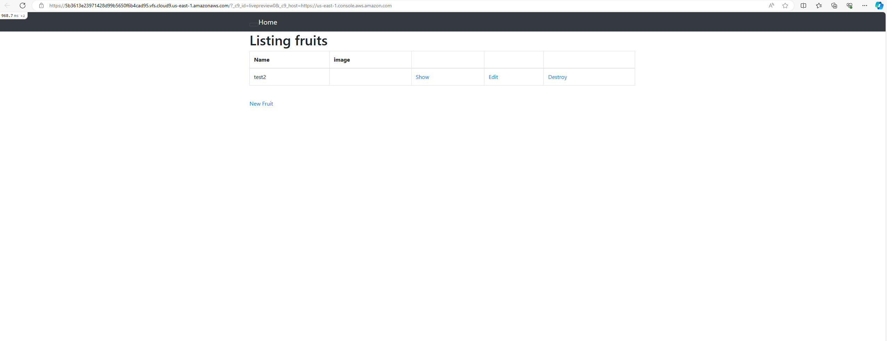
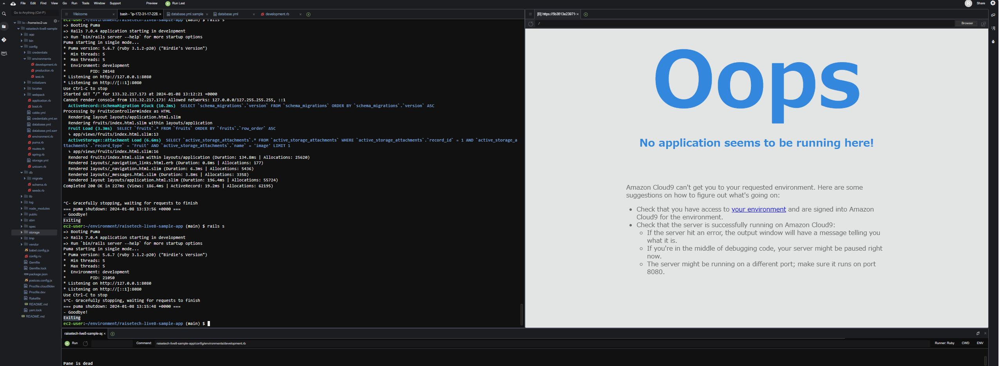
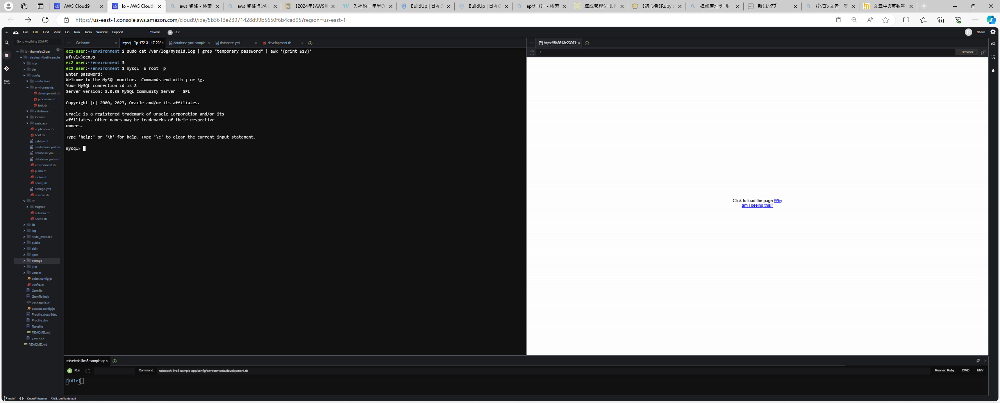
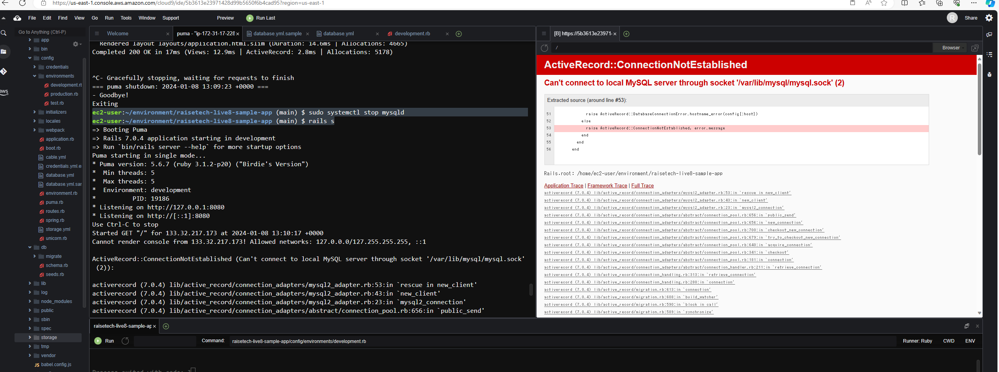
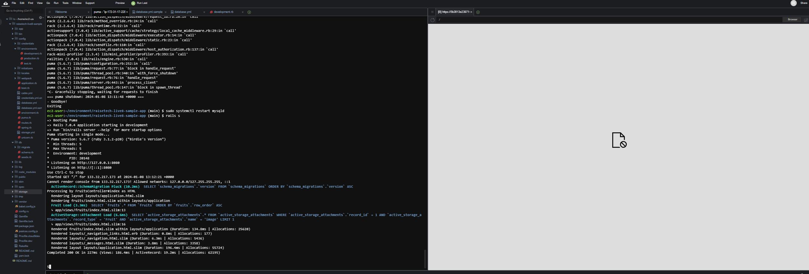
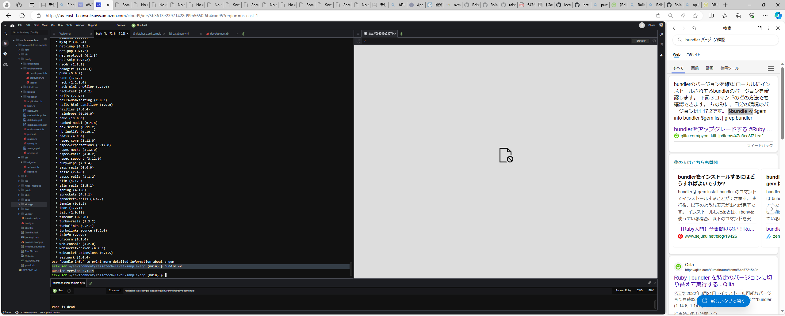

# 第三回課題

##サンプルアプリケーションのデプロイ
1. 動作環境を整える  
バージョン確認、動作環境に合うバージョンのインストール、動作環境に合うバージョンへ切り替え。
・ruby3.1.2  `ruby -v` `rvm install 3.1.2` `rvm use 3.1.2`  
・yarn1.22.19 `yarn -v` `npm install -g yarn@1.22.19` `yarn set version 1.22.19`  
・Node17.9.1 `node -v` `nvm install 17.9.1` `nvm use 17.9.1`  

2. DBエンジンのインストール
事前準備  
・`yum`コマンド→Amazon　Linux2だと確認  
・ディスク容量の確保(`docker system prune -a`→`y`)  
・インストール  
以下を貼り付け  
`curl -fsSL https://raw.githubusercontent.com/MasatoshiMizumoto/raisetech_documents/main/aws/scripts/mysql_amazon_linux_2.sh | sh`  
・初期パスワードの入手、動作確認  
　初期パスワードの確認  
`sudo cat /var/log/mysqld.log | grep "temporary password" | awk '{print $13}'`  
　ログイン確認　パスワード要求が出るので控えたパスワードを入力  
`mysql -u root -p`  

3. database.ymlのコピー及び入力  
database.ymlのコピー  
`cd raisetech-live8-sample-app/`  
`cp config/database.yml.sample config/database.yml`  

4. mySQLのパスワードとsocketの入力  
socketを確認`cat /etc/my.cnf/`  

5. Linuxでファイルやディレクトリのパーミッションを変更  
オーナーに読み取り、書き込み、実行権限を与え、グループとその他のユーザーには読み取りと実行権限を与える。  
`sudo chmod 755`  

6. 環境構築、アプリケーションの起動  
開発環境のセットアップの自動化(アプリケーションの依存関係をインストール、データベースの設定、必要なファイルをコピーなど)  
`bin/setup`  
環境構築後、アプリケーションの起動  
`bin/cloud9_dev`  
  

## APサーバー
 APサーバーとはアプリケーションを実行するためのサーバーである。負荷分散のために役割を振り分けられているため(アプリケーション実行の役割)、単体で使うケースはほとんどない。

### 本課題で使用されているAPサーバー
 名前　Puma  
 バージョン　5.6.7

### APサーバーを終了させた場合、引き続きアクセスできるか
1. APサーバー終了させるとアクセスできない(コマンド`rails s`→ `Ctrl＋c`)。

2. もう一度起動させるとアクセスできるようになる(コマンド`rails s`)。

## DBサーバー
DBサーバーとはアプリケーションで利用するデータを格納し操作するためのサーバーである。データの作成(create)、データの読み出し(read)、データの更新(updata)、データの削除(delete)を基本機能とし、これらをまとめて「CRUD」という。

### 本課題で使用されているDBサーバー
 名前　mySQL  
 バージョン　8.0.35

### DBサーバーを終了させた場合、引き続きアクセスできるか
1. DBサーバーを終了させるとアクセスできない(コマンド`sudo systemctl stop mysqld`→`rails s`)。

2. もう一度起動させるとアクセスできるようになる(コマンド`sudo systemctl restart mysqld`→`rails s`)。

## Railsの構成管理ツール
名前　Bundle  
RailsはBundleを使用し開発に必要なgemパッケージを管理する。インストール、パッケージの更新やアンインストールなどの操作も行っている。
　　

　参考URL
 https://kitsune.blog/rails-summary  
 https://wa3.i-3-i.info/word13277.html