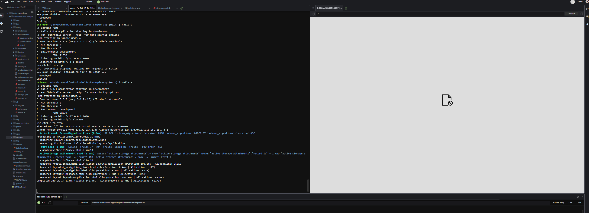

# 第三回課題

## APサーバー
### APサーバーとはアプリケーションを実行するためのサーバーである。負荷分散のために役割を振り分けられているため(アプリケーション実行の役割)、単体で使うケースはほとんどない。

## 本課題で使用されているAPサーバー
### 名前　Puma
### バージョン　5．6.7

## APサーバーを終了させた場合、引き続きアクセスできるか
1. APサーバー終了させるとアクセスできない(コマンド　rails s →　Ctrl＋c)。

2. もう一度起動させるとアクセスできるようになる(コマンド　rails s)。

## DBサーバー
### DBサーバーとはアプリケーションで利用するデータを格納し操作するためのサーバーである。データの作成(create)、データの読み出し(read)、データの更新(updata)、データの削除(delete)を基本機能とし、これらをまとめて「CRUD」という。

## 本課題で使用されているDBサーバー
### 名前　mySQL
### バージョン　8.0.35

1. DBサーバーを終了させるとアクセスできない(コマンド　sudo systemctl stop mysqld→ rails s)。

2. もう一度起動させるとアクセスできるようになる(コマンド　sudo systemctl restart mysqld → rails s)。
根拠画像⑥

## Railsの構成管理ツール
### 名前　Bundle
### RailsはBundleを使用し開発に必要なgemパッケージを管理する。インストール、パッケージの更新やアンインストールなどの操作も行っている。

### 参考URL
### https://kitsune.blog/rails-summary
### https://wa3.i-3-i.info/word13277.html