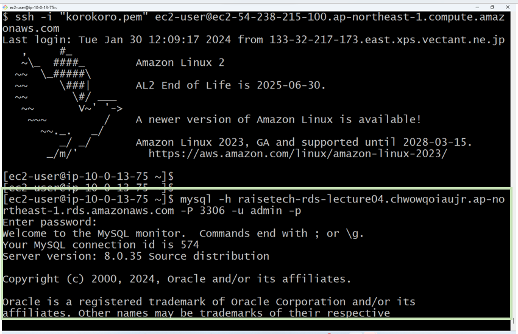

# 第四回課題
## VPC作成
  
## EC2構築
  
### セキュリティグループ
  
## RDS構築
  
### セキュリティグループ
 
 
### サブネットはいずれもプライベートサブネット

  
## ローカルからEC2にssh接続
  
## EC2からRDSに接続
  
* ローカルからEC2へのssh接続ではgitbashを使い接続を行った。
* 接続の図を描くことで実施内容を明確にしながら進められた。
* 先生方への質問内容を考えることが学びになっているので、仮説を立てる段階を丁寧に行っていきたい。
